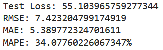
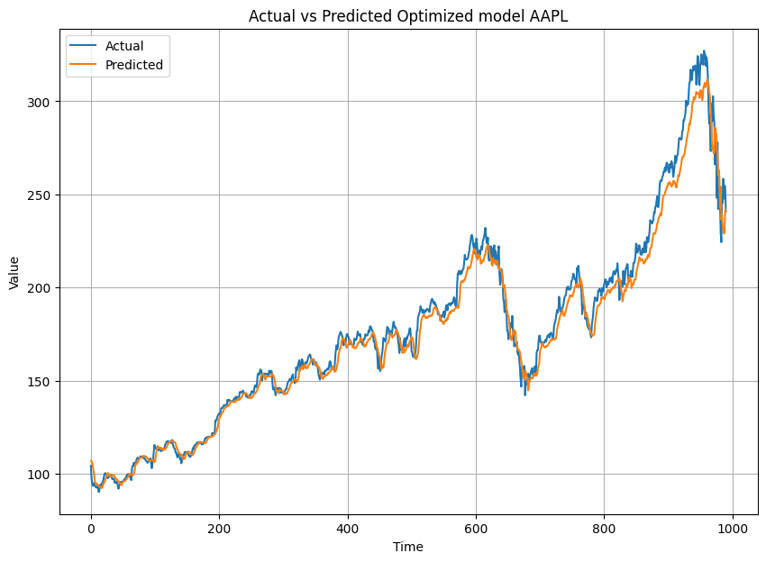
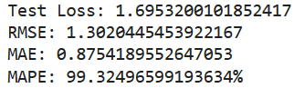
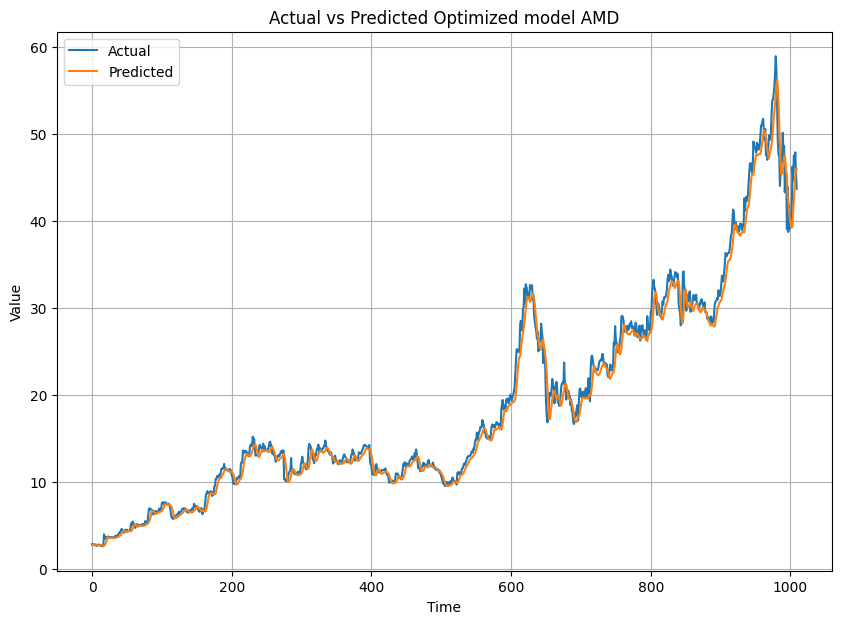

# Stock Price Prediction Using LSTM

## Executive Summary
This project aims to predict daily stock prices for Apple Inc. (AAPL) and Advanced Micro Devices, Inc. (AMD) using Long Short-Term Memory (LSTM) architecture. Two LSTM models are developed: a baseline model and a modified model. The goal is to provide valuable insights to help investors make informed investment decisions by comparing the performance of these models.

## Business Problem
Stock price prediction is complex due to market volatility and various influencing factors. Accurate forecasting models are needed by investors to reduce risks and increase returns. This project focuses on predicting daily stock prices for AAPL and AMD using historical stock data and LSTM models.

## Methodology

### Data Collection
- Data source from [Kaggle's Stock Market Dataset](https://www.kaggle.com/datasets/jacksoncrow/stock-market-dataset).
- Historical daily price data for AAPL and AMD was collected using the Python package `yfinance`.
- Collected columns include the date, open price, close price, and volume.

### Data Preprocessing
- Only the date and closing price columns were used for prediction.
- A sliding window technique was applied, using the previous 5 days as input to predict the next day’s price.

### Data Visualization
- Visualizing stock price trends is crucial for understanding market behavior. The closing prices for AAPL and AMD were plotted to analyze their trends over time.

#### AAPL Stock Price Trend

The chart shows the stock price trend of Apple Inc. from 1980 to 2020. Significant growth occurred after 2000. A sharp price rise began after 2010. The stock reached over $300 by 2020. Despite some fluctuations, the long-term trend reflects strong growth. This highlights Apple's success in the market.

#### AMD Stock Price Trend

The chart shows the stock price trend of AMD from 1980 to 2020. The stock experienced notable fluctuations. The highest peak occurred in 2000, followed by a decline. Since 2016, AMD’s price has increased consistently. The stock reached over $50 by 2020. This reflects AMD's growing competitiveness in the tech industry.

### Model Development
- **Baseline LSTM Model**: Uses 50 units in the LSTM layer with a ReLU activation function, followed by a dense layer with one unit for output.
- **Modified LSTM Model**: Various architectural changes were applied, including adding more layers and experimenting with hyperparameters to improve prediction accuracy.

### Model Evaluation
Both models were evaluated using the following performance metrics:
- **RMSE** (Root Mean Square Error)
- **MAE** (Mean Absolute Error)
- **MAPE** (Mean Absolute Percentage Error)

## Skills
- Proficiency in Python and libraries such as pandas, numpy, and TensorFlow.
- Experience in time series analysis, LSTM architecture, and data preprocessing.
- Expertise in model development, optimization, and evaluation.

## Results

### Baseline LSTM Model
The baseline model produced accurate predictions for both AAPL and AMD stock prices, performing well in terms of RMSE, MAE, and MAPE. It’s a simple yet effective architecture for this task.

#### AAPL Baseline Model Metrics

#### AMD Baseline Model Metrics

### Modified LSTM Model
The modified model introduced more layers and different hyperparameters, but did not outperform the baseline model consistently across all metrics.

#### AAPL Modified Model Metrics

#### AMD Modified Model Metrics

## Business Recommendations
The baseline LSTM model is recommended as the primary model for stock price prediction. While the modified model showed some improvements, the simplicity and consistent performance of the baseline model make it more practical for real-world use. Investors should integrate this model into their analysis strategies to make informed decisions.

## Next Steps
- **Model Deployment**: Deploy the LSTM model into a stock prediction application for real-time forecasts.
- **Model Improvement**: Continue exploring alternative architectures or ensemble techniques for potential performance gains.
- **Continuous Monitoring**: Implement regular performance monitoring to ensure the model adapts to changing market conditions.

