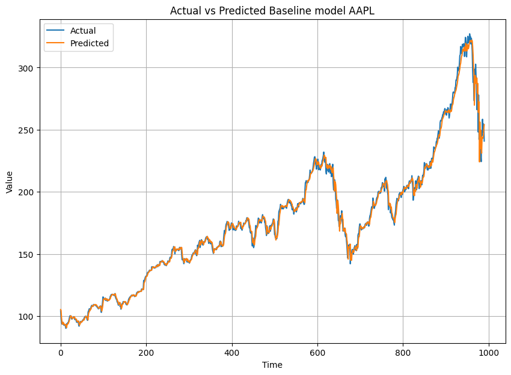

# Stock Price Prediction Using LSTM

## Executive Summary

This project aims to predict daily stock prices for Apple Inc. (AAPL) and Advanced Micro Devices, Inc. (AMD) using Long Short-Term Memory (LSTM) architecture. Through this approach, the goal is to provide valuable insights for investors in making investment decisions. The analysis compares two LSTM models: a baseline model and a modified model.

## Business Problem

The stock market is highly dynamic and influenced by various factors, making stock price prediction a complex challenge. Investors need accurate methods to forecast stock movements to minimize investment risks and maximize returns. This project focuses on predicting daily stock prices for AAPL and AMD using historical data.

## Methodology

### Data Collection
- Daily historical price data for AAPL and AMD was collected from Yahoo Finance using the Python package `yfinance`, including columns such as date, open price, close price, and volume.

### Data Preprocessing
- Preprocess the data to structure the date and closing price columns.
- Implement a sliding window technique with a window size of 5 days for input and a horizon of 1 day for output.

### Model Development
- **Baseline LSTM Model**: Utilizes 50 units with a ReLU activation function in the LSTM layer and a Perceptron node with one unit in the final layer.
- **Modified LSTM Model**: Explores various modifications to the architecture and hyperparameters to improve performance.

### Model Evaluation
- Evaluate both models using performance metrics such as RMSE (Root Mean Square Error), MAE (Mean Absolute Error), and MAPE (Mean Absolute Percentage Error).

### Data Visualization
- Visualizing stock price trends is crucial for understanding market behavior. The closing prices for AAPL and AMD were plotted to analyze their trends over time.

#### AAPL Stock Price Trend

The chart shows the stock price trend of Apple Inc. from 1980 to 2020. Significant growth occurred after 2000. A sharp price rise began after 2010. The stock reached over $300 by 2020. Despite some fluctuations, the long-term trend reflects strong growth. This highlights Apple's success in the market.

#### AMD Stock Price Trend

The chart shows the stock price trend of AMD from 1980 to 2020. The stock experienced notable fluctuations. The highest peak occurred in 2000, followed by a decline. Since 2016, AMD’s price has increased consistently. The stock reached over $50 by 2020. This reflects AMD's growing competitiveness in the tech industry.

## Skills

- Proficient in Python programming and using libraries such as pandas, numpy, and TensorFlow for model development.
- Data analysis skills, including data exploration and preprocessing.
- Understanding of LSTM architecture and model optimization techniques.

## Results

From both LSTM architectures, the baseline model demonstrated superior performance regarding evaluation metrics, including RMSE, MAE, and MAPE, for both AAPL and AMD data. The results indicate that despite the adjustments in the modified model, the simpler baseline model yielded more accurate predictions.

### Model Metrics Visualization
#### Time Series Predictions for AAPL

#### Time Series Predictions for AMD

## Business Recommendations

Based on the evaluation results, it is recommended to use the baseline LSTM architecture as the primary model for stock price prediction. While architectural modifications may seem appealing, the results show that simplicity in modeling can be more effective. Investors are advised to incorporate this model into their stock analysis strategies.

## Next Steps

- **Model Deployment**: Integrate the LSTM model into a stock price prediction application for easy access by investors.
- **Model Improvement**: Conduct further experiments with ensemble techniques or other machine learning models for comparison.
- **Continuous Monitoring**: Implement regular performance monitoring of the model to ensure prediction accuracy remains high as market conditions change.
